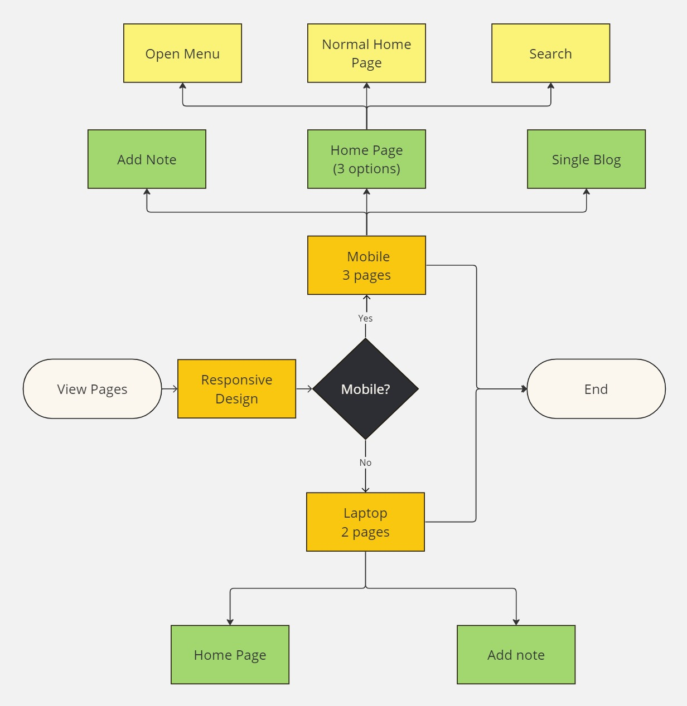

# Notes App

This is a simple Notes App project built using HTML, CSS, and JavaScript (with some parts written in SASS for improved styling). The application allows users to add, delete, search, and highlight notes.

## [Live Site](https://note-app-mansy.netlify.app)
## [Figma Dsign](https://www.figma.com/file/FSzGesa0hMQsYPd1B41s8F/Note-app-almdrasa-js-diploma-project?type=design&node-id=0-1&mode=design&t=q4qXoR5CmH9Wfk9T-0)
## [Planning](https://miro.com/app/board/uXjVNpUOf3c=/?share_link_id=519429178805)

## Frameworks:
  
## Table of Contents

- [Screenshots](#screenshots)
- [Features](#features)
- [Installation](#installation)
- [Usage](#usage)
- [Contributing](#contributing)
- [License](#license)
- [Contact](#contact)

## Screenshots

### 1.Planning
<div align="center">
  
</div>
<div align="center">
  
</div>


### 2.UI

<div align="center">
  
  
</div>

### 3.Responsive
<div align="center">
  
  
</div>
<div align="center">
  
  
  
</div>

## Features

- **Add Note**: Users can add new notes with a title, author, and details.
- **Delete Note**: Notes can be deleted individually.
- **Search**: Users can search for specific notes using keywords.
- **Highlighting**: Matching notes are highlighted for better visibility.
- **LocalStorage**: Notes are saved in the browser's localStorage for persistence.

## Installation

To run this project locally, follow these steps:

1. Clone the repository:

   ```bash
   git clone <repository-url>
   ```

2. Navigate to the project directory:

   ```bash
   cd notes-app
   ```

3. Open the `index.html` file in your preferred web browser.

## Usage

- **Adding a Note**: Click on the "Add Note" button and fill in the title, author, and details of the note. Then, click "Add Note" or "Add Pinned Note" to add the note.
- **Deleting a Note**: Click on the "Delete" button next to the note you want to delete.
- **Searching for Notes**: Type keywords in the search bar to filter notes. Matching notes will be highlighted.
- **Viewing Note Details**: Click on a note's title to view its details in the blog section.

## Contributing

Contributions are welcome! If you find any bugs or want to suggest improvements, please open an issue or submit a pull request. Make sure to follow the [code of conduct](CODE_OF_CONDUCT.md).

## License

This project is licensed under the [MIT License](LICENSE).


## Contact

- [Author](https://github.com/MMansy19)
- [Website](https://mahmoud-mansy-portfolio.netlify.app/)
- [Email](mailto:mahmoud2abdalfattah@gmail.com)
- [LinkedIn](https://www.linkedin.com/in/mahmoud-mansy-a189a5232)

